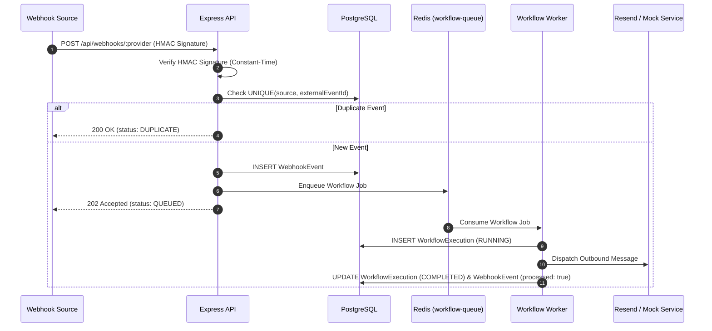
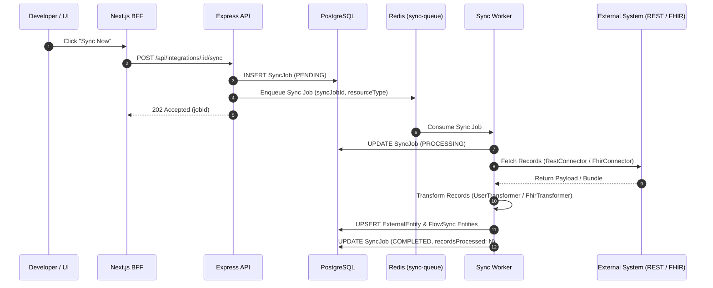

# FlowSync Architecture & Technical Documentation

FlowSync is an enterprise multi-system data integration and automation platform designed around a decoupled, asynchronous, event-driven architecture.

---

## System Component Overview

```mermaid
graph TD
    Client[Next.js App Router Frontend] -->|HTTP / Relative Path| BFF[Next.js Server-Side BFF Proxy]
    BFF -->|Bearer Auth / Port 3001| ExpressAPI[Express REST & Webhook API]
    
    ExpressAPI -->|Read/Write Metadata| Postgres[(PostgreSQL Database)]
    ExpressAPI -->|Enqueue Jobs| Redis[(Redis / BullMQ)]
    
    SubGraph Workers[Background Workers Process Loop]
        SyncWorker[Sync Worker]
        WorkflowWorker[Workflow Worker]
    end
    
    Redis --> SyncWorker
    Redis --> WorkflowWorker
    
    SyncWorker -->|UPSERT Entities| Postgres
    SyncWorker -->|Fetch Data| ExtREST[RandomUser REST API]
    SyncWorker -->|Fetch Data| ExtFHIR[HAPI FHIR R4 Sandbox]
    
    WorkflowWorker -->|Outbound Dispatch| MsgConnector[Messaging Connector]
    MsgConnector -->|HTTP Delivery| ResendAPI[Resend Outbound Email API / Mock]
```

---

## Data Pipeline Architecture

### 1. Inbound Webhook Pipeline (Idempotent & Event-Driven)



### 2. Generic REST & FHIR Synchronization Pipeline



---

## Architectural Principles & Engineering Decisions

### 1. API / Worker Separation
The Express API server and BullMQ background workers run as separate Node.js processes. The API server only handles request validation, authentication, and queueing, guaranteeing fast response times (< 50ms) and high availability even under heavy processing loads.

### 2. Database-Level Idempotency
To prevent duplicate processing during network retries or worker restarts:
- Inbound Webhooks are enforced via `UNIQUE(source, external_event_id)` on the `WebhookEvent` table.
- External Entities are mapped via `UNIQUE(source_system, external_id, entity_type)` on the `ExternalEntity` table using PostgreSQL `UPSERT` statements.

### 3. Server-Side BFF Security
The Next.js App Router acts as a Backend-For-Frontend (BFF) proxy route (`/api/[...path]`). Client-side JavaScript bundles receive relative paths only (`/api/*`), while secret API keys (`API_KEY`) remain strictly isolated within server-side process environment variables.

### 4. Exponential Backoff & Retry Classification
Errors are classified into **transient** (e.g., HTTP 429, 500, 502, 503, 504, network timeouts) and **permanent** (e.g., HTTP 400, 401, 403, 422). Transient errors automatically retry with exponential backoff (`0s`, `30s`, `2m`, `10m`), while permanent errors immediately trigger a non-retryable failure classification.
